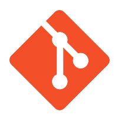

<h1 id="matheus">👋 Hi, i'm Matheus</h1>

<h3>:zap: A Few Quick Facts</h2>

- :office: I’m currently studying in <a href="https://www.ifsp.edu.br/">Instituto Federal</a>.
- 🧐 Learning about <strong>Godot</strong>.</li>
- :pencil2: Arch Linux / AwesomeWM / Oh My Zsh / Neovim.
- 👨‍💻 Most of my projects are available on <a href="https://github.com/m4thewz">Github</a>.
- 💬 Ask me about <strong>vue, html, css, js and py</strong>.
- 📙 See more in my <a href="https://m4thewz.github.io">portfolio</a>.

 

<h2 align="left" id="tech">Favorite Tech</h2>

> Tools, languages, and other things that I like to work with.

<table>
  <tr>
    <td align="center" width="96">
      
       NodeJS
    </td>
    <td align="center" width="96">
      
       JavaScript
    </td>
    <td align="center" width="96">
      
       VueJS
    </td>
    <td align="center" width="96">
      
       Tailwind
    </td>
    <td align="center" width="96">
      
       HTML
    </td>
    <td align="center" width="96">
      
       CSS
    </td>
    <td align="center" width="96">
      
       Sass
    </td>
  </tr>
  <tr>
    <td align="center"  width="96">
      
       Arch Linux
    </td>
    <td align="center"  width="96">
      
       Linux
    </td>
    <td align="center" width="96">
      
       Git
    </td>
    <td align="center"  width="96">
      
       MongoDB
    </td>
    <td align="center" width="96">
      
       Insomnia
    </td>
    <td align="center" width="96">
      
       Vim
    </td>
    <td align="center" width="96">
      
       Figma
    </td>
  </tr>
</table>
